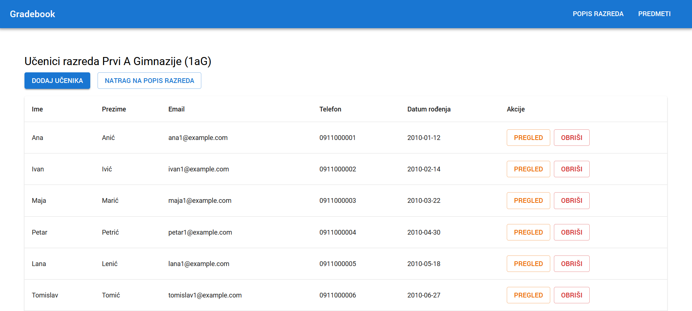
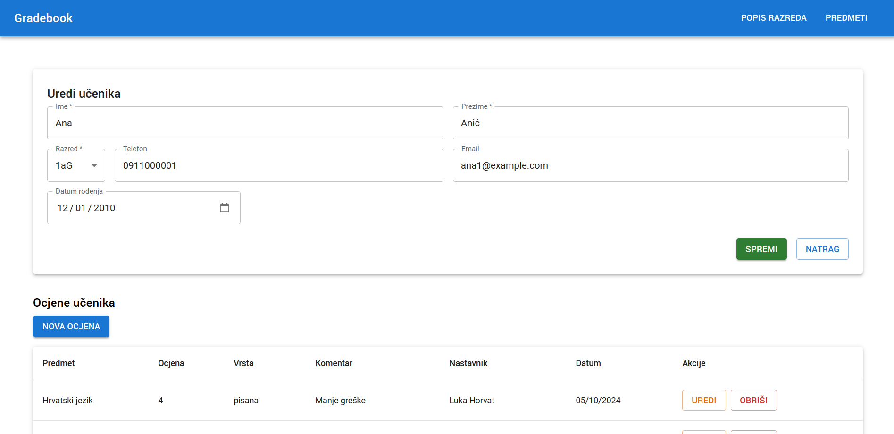

# Gradebook
## Features
* View classes and their students
* Edit student details
* Add grades

## Technologies
* Spring
* React
* MaterialUI
* PostgreSQL

## To-do
* Add a relation between class and its homeroom teacher

## Screenshots

